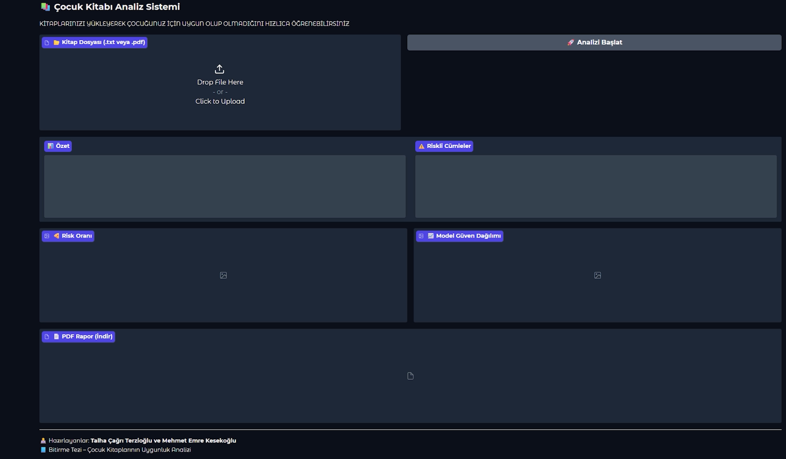
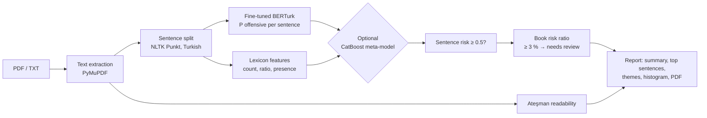
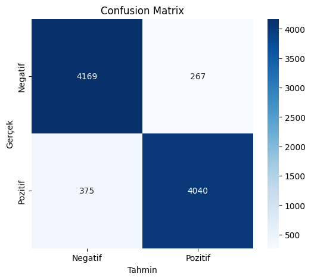
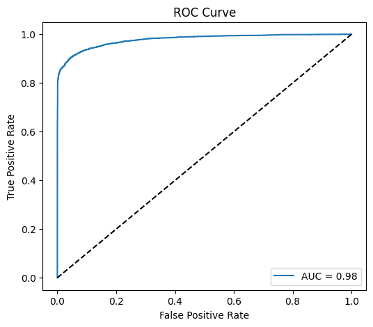
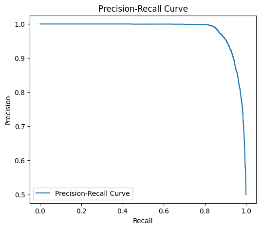

# Turkish Book Content Screener

[](https://github.com/cagritalha0/turkish-book-content-screener/actions/workflows/tests.yml)


Upload a Turkish book (PDF or TXT) and this tool scores **every sentence** with a fine-tuned
**BERTurk** classifier. It then reports how much of the book may be unsuitable for children,
shows the highest-scoring sentences, names the themes involved (violence, drugs, sexual content,
profanity, crime) and adds an **Ateşman readability** score. You get the result in a Gradio UI
and as a downloadable PDF report.

> BSc graduation project, Computer Engineering, Karabük University (2024–2025), by
> **Talha Çağrı Terzioğlu** and **Mehmet Emre Kesekoğlu**, supervised by Asst. Prof. Nesrin Aydın Atasoy.
> Since graduation the repository is maintained by Talha Çağrı Terzioğlu, who refactored the original
> Colab notebook into a tested package (see [Authors](#authors) and
> [What changed after the thesis](#what-changed-after-the-thesis)).



## How it works



1. **Sentence classifier.** [`dbmdz/bert-base-turkish-128k-uncased`](https://huggingface.co/dbmdz/bert-base-turkish-128k-uncased)
   fine-tuned for binary offensive-language classification on ~53k labelled Turkish tweets
   ([dataset](data/README.md)). Max length 128, batch size 16, 3 epochs, AdamW (the thesis run used the Hugging Face default learning rate of 5e-5; `train_bert.py` defaults to 2e-5 with warm-up).
2. **Lexicon features.** Whole-token matches against a curated Turkish word list
   ([provenance and changes](data/lexicon/NOTICE.md)).
3. **Meta-model (optional).** CatBoost tuned with Optuna on BERT probabilities plus lexicon features.
   It is trained on a hold-out slice that BERT never saw.
4. **Book-level decision.** A book is flagged for human review when at least 3 % of its sentences
   score ≥ 0.5. The themes shown are keyword hits found in the flagged sentences only.
5. **Readability.** Ateşman (1997): `198.825 − 40.175 × syllables/word − 2.610 × words/sentence`.

## Results

Measured on the dataset's held-out **test split** (8,851 tweets, balanced 4,436 / 4,415) in the
thesis run (Google Colab, May 2025):

| Model | Accuracy | F1 (offensive) | Macro F1 | ROC-AUC |
|---|---:|---:|---:|---:|
| **Fine-tuned BERTurk** | **0.928** | **0.926** | **0.928** | **0.98** |
| BERTurk + CatBoost (thesis version) | 0.925 | 0.924 | 0.925 | n/a |

<p>
  
  
  
</p>

**What the numbers mean:**

- In the thesis version the CatBoost stack **did not improve** on BERT. It was fitted on BERT's
  predictions for BERT's *own training data*. Those predictions are over-confident, so CatBoost
  learned to copy BERT. The refactored `train_meta.py` fits it on a hold-out split instead.
  Re-running it is open work, so no number for it is claimed here.
- These are **tweet-level** metrics. The model is applied to book sentences, which are a different
  domain. There is no labelled book-level benchmark yet, so the book verdict should be treated as a
  screening aid for a human reviewer, not a rating.

## Quick start

```bash
git clone https://github.com/cagritalha0/turkish-book-content-screener.git
cd turkish-book-content-screener
python -m venv .venv && source .venv/bin/activate      # Windows: .venv\Scripts\activate
pip install -e ".[train,app,dev]"

# 1. put train/valid/test.csv in data/raw/  (see data/README.md)
python scripts/train_bert.py --data-dir data/raw --output-dir models/berturk-offensive   # GPU recommended
python scripts/train_meta.py --model-dir models/berturk-offensive                         # optional
python scripts/evaluate.py   --model-dir models/berturk-offensive --meta-model models/meta_catboost.cbm

# 2. run the app
python app.py --model-dir models/berturk-offensive [--meta-model models/meta_catboost.cbm]
```

Fine-tuning took about 27 minutes for 3 epochs on a Colab GPU. Trained weights are not published,
so run `train_bert.py` to reproduce them.

Run the tests (no GPU or model needed; BERT is replaced by a stub):

```bash
pytest -q && ruff check .
```

## Project structure

```
src/bookscreener/
  text.py         Turkish-aware lower-casing, cleaning, sentence split, Ateşman score
  lexicon.py      word-list loading and whole-token lexicon features
  features.py     one feature builder shared by training and inference
  scorer.py       batched BERTurk inference
  analyzer.py     book-level aggregation → BookReport
  categories.py   theme keywords for explanations (no identity terms)
  report.py       histogram + PDF report (Unicode font for ş, ğ, ı)
  io.py           PDF / TXT reading with Turkish encoding fallbacks
scripts/          train_bert.py · train_meta.py · evaluate.py
app.py            Gradio UI
tests/            pytest suite, runs in CI
notebooks/        archived original thesis notebook (outputs cleared)
```

## What changed after the thesis

The thesis prototype was a single Colab notebook. Reviewing it for publication turned up real bugs.
Fixing them was the main work of the refactor:

| Problem in the notebook | Fix |
|---|---|
| The app loaded a 3-row demo CatBoost model saved to the same path (`/content/model`); the trained model was never saved. On the test set that demo model scored 60.8 % accuracy. | `train_meta.py` saves the trained model and its feature list; BERT-only is the default. |
| Train/serve skew: CatBoost trained on 6 features, the app sent 5. | One `build_features()` used on both sides. |
| Meta-model fitted on in-sample BERT predictions. | Stratified hold-out never shown to BERT, plus 5-fold CV inside Optuna. |
| Theme detection used substring search, so `"am"` matched `"ama"` and `"adam"`. | Whole-token matching, with a regression test. |
| `str.lower()` breaks Turkish `I/İ`; Ateşman computed on mixed-case text. | `turkish_lower()`, case-insensitive syllable counting. |
| Word list contained ethnic, religious, national and LGBT terms as "offensive". | Removed; documented in [NOTICE](data/lexicon/NOTICE.md). |
| PDF report printed `ş/ğ/ı` as boxes (Helvetica). | DejaVu Sans embedded. |
| Sentence-by-sentence CPU inference, hard-coded Drive paths, validation split unused. | Batched inference, CLI arguments, per-epoch validation with best-checkpoint selection. |

## Limitations

- **Domain shift:** trained on tweets and applied to literature. Book sentences with dialogue or
  historical violence will be scored differently from how a teacher would read them.
- **Binary, not age-banded:** the output is "suitable / needs review", not an age range.
- **Lexicon and theme lists are hand-made** and incomplete. They explain a decision; they do not make it.
- The 3 % book threshold was set by hand and has not been validated against human ratings.

## Authors

| | Thesis prototype (2024–2025) | Refactor and maintenance (2026–) |
|---|:---:|:---:|
| Talha Çağrı Terzioğlu | ✓ | ✓ |
| Mehmet Emre Kesekoğlu | ✓ | |

The archived notebook in [`notebooks/`](notebooks/) is the joint thesis work. The refactored package
(`src/`, `scripts/`, `tests/`, `app.py`) and all later changes are by Talha Çağrı Terzioğlu (see the commit history).

## Acknowledgements

- The architecture was inspired by [KitapMetre](https://github.com/Abra-Muhara/kitapmetre-2024AcikHackTDDI)
  (Abra Muhara team, TEKNOFEST 2024), which also combined fine-tuned BERTurk with a word list.
  Our lexicon is a modified version of theirs (Apache-2.0).
- BERTurk by the [MDZ Digital Library team](https://github.com/stefan-it/turkish-bert).
- Dataset by Tanyel et al. (2022), see [data/README.md](data/README.md).

## License

Code: [MIT](LICENSE). Lexicon: Apache-2.0 (see [NOTICE](data/lexicon/NOTICE.md)).
